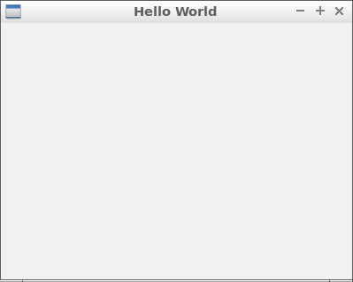

01 Hello World Window ( wxApp & wxFrame )
===



```c++
#include <wx/wx.h>

//declare a application

class MyApp : public wxApp {
public:
  virtual bool OnInit();
};


//declare a frame

class MyFrame : public wxFrame {
public:
  MyFrame();
private:
};

//define method of the application.

bool MyApp::OnInit() {
  MyFrame *frame = new MyFrame();
  frame->Show(true);
  return true;
}

//define constructor of frame.

MyFrame::MyFrame()
: wxFrame(NULL, wxID_ANY, "Hello World", wxDefaultPosition, wxSize(400, 320)) {

}

wxIMPLEMENT_APP(MyApp); //implement the application
```


這支範例程式基本上做了這幾件事：

1. 宣告 MyApp
2. 宣告 MyFrame
3. 定義 MyApp （實做 OnInit 方法）
4. 定義 MyFrame （定義建構子）
5. 程式進入點


### wxFrame

我們定義了兩個類別分別繼承了 wxApp 和 wxFrame，wxFrame 就像 VB.NET 的 Form 代表了視窗。

這樣的設計允許我們在一個**應用程式**下有兩個以上的**視窗**，在不少軟體都可以看到，比如 Steam 就（大概）是如此：


### 程式進入點

一般 C++ 的程式進入點 main 函式被定義在 wx/app.h 之中，

因此你只要在主程式中呼叫下面的函式，就會建構一個 C++ 程序進入點。

```c++
wxIMPLEMENT_APP(MyApp); 
```


### 參考

https://www.itread01.com/content/1547247796.html