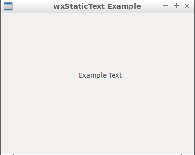

02 Label ( wxStaticText )
===



```c++
#include <wx/wx.h>

//declare a application

class MyApp : public wxApp {
public:
  virtual bool OnInit();
};

//declare a frame

class MyFrame : public wxFrame {
public:
  MyFrame();
private:
  wxStaticText *label;
  wxPanel * panel;
};

//define method of the application.

bool MyApp::OnInit() {
  MyFrame *frame = new MyFrame();
  frame->Show(true);
  return true;
}

//define constructor of frame.

MyFrame::MyFrame()
: wxFrame(NULL, wxID_ANY, "wxStaticText Example", wxDefaultPosition, wxSize(400, 320)) {
  this->panel = new wxPanel(this, wxID_ANY);

  this->label = new wxStaticText(
          this->panel, wxID_ANY, "Example Text",
          wxPoint(160, 120), wxSize(100, 20));
}

wxIMPLEMENT_APP(MyApp); //implement the application
```


如果我們將 label 的容器直接設定為 frame：

```c++
new wxStaticText(
          this, wxID_ANY, "Example Text",
          wxPoint(160, 120), wxSize(100, 20));
```


會發現我們沒辦法調整標籤的位置，這是因為當 wxFrame 只有一個成員的時候，它會將該控件延伸並填滿整個框。如果你使用 wxButton 這樣做，效果會十分明顯：你會得到一個超大的按鈕。

因此要在標籤和視窗之間放入一個容器 wxPanel 來處理這個問題，這麼一來 wxPanel 會被延伸填滿整個視窗，而標籤則是身處 wxPanel 之中，我們就可以決定標籤在當中的位置與大小了。


### 參考

https://forums.wxwidgets.org/viewtopic.php?t=39671

https://docs.wxwidgets.org/3.0/classwx_static_text.html