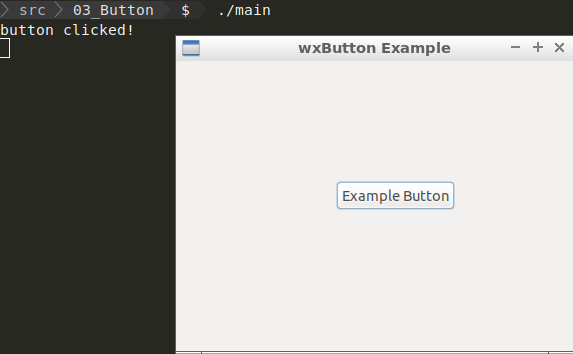

03 Button ( wxButton )
===



```c++
#include <wx/wx.h>
#include <iostream>

//declare a application

class MyApp : public wxApp {
public:
  virtual bool OnInit();
};

//declare a frame

class MyFrame : public wxFrame {
public:
  MyFrame();
private:
  wxButton *button;

  void buttonClicked(wxCommandEvent & event);
};

//define method of the application.

bool MyApp::OnInit() {
  MyFrame *frame = new MyFrame();
  frame->Show(true);
  return true;
}

//define constructor of frame.

MyFrame::MyFrame()
: wxFrame(NULL, wxID_ANY, "wxButton Example", wxDefaultPosition, wxSize(400, 320)) {
  wxPanel * panel = new wxPanel(this, wxID_ANY);

  this->button = new wxButton(panel, wxID_ANY, wxT("Example Button"),
          wxPoint(160, 120), wxDefaultSize, 0);

  Connect(this->button->GetId(), wxEVT_COMMAND_BUTTON_CLICKED,
          wxCommandEventHandler(MyFrame::buttonClicked));
}

void MyFrame::buttonClicked(wxCommandEvent & event) {
  std::cout << "button clicked!\n";
}

wxIMPLEMENT_APP(MyApp); //implement the application

```


### 事件處理

除了範例中設定按鈕事件的方法外，其實還有另外一種方式：靜態事件表，但是它的語法大概長這樣：

```c++
BEGIN_EVENT_TABLE(MyFrame, wxFrame)
    EVT_BUTTON(wxID_EXIT, MyFrame::OnQuit)
END_EVENT_TABLE()
```

噁...可以看到它的語法比較沒這麼現代，所以就沒放在範例裡面了。


### 事件連接

```c++
Connect(this->button->GetId(), wxEVT_COMMAND_BUTTON_CLICKED,
          wxCommandEventHandler(MyFrame::buttonClicked));
```

我們可以看到這段程式將我們定義的 `MyFrame::buttonClicked` 方法連結到某個按鈕（控件）下的 `wxEVT_COMMAND_BUTTON_CLICKED` 事件，而辨識控件的方式是當我們建構按鈕時的 `wxID_ANY` 給予：

```c++
new wxButton(panel, wxID_ANY, wxT("Example Button"),
          wxPoint(160, 120), wxDefaultSize, 0);
```

wxID_ANY 會讓 wxWidgets 會自動生成一個不重複的負數對該控件進行編號處理，我們也可以根據控件的職責並使用 wxWidgets 定義的[編號](https://docs.wxwidgets.org/3.1/defs_8h.html#ac66d0a09761e7d86b2ac0b2e0c6a8cbb)。


### 參考

https://www.itread01.com/content/1536140316.html

https://codertw.com/前端開發/50794/

https://docs.wxwidgets.org/trunk/overview_windowids.html

https://docs.wxwidgets.org/3.0/classwx_button.html