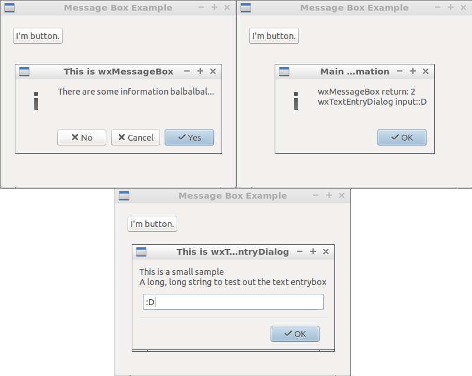

04 Message Box ( wxLogMessage, wxTextEntryDialog & wxMessageBox )
===



```c++
#include <wx/wx.h>
#include <iostream>
#include <string>

//declare a application

class MyApp : public wxApp {
public:
  virtual bool OnInit();
};

//declare a frame

class MyFrame : public wxFrame {
public:
  MyFrame();
private:
  wxButton *button;

  void buttonClicked(wxCommandEvent & event);
};


//define method of the application.

bool MyApp::OnInit() {
  MyFrame *frame = new MyFrame();
  frame->Show(true);
  return true;
}

//define constructor of frame.

MyFrame::MyFrame()
: wxFrame(NULL, wxID_ANY, "Message Box Example", wxDefaultPosition, wxSize(400, 320)) {
  wxPanel * panel = new wxPanel(this, wxID_ANY);

  this->button = new wxButton(panel, wxID_ANY, wxT("I'm button."),
          wxPoint(20, 20), wxDefaultSize, 0);

  Connect(this->button->GetId(), wxEVT_COMMAND_BUTTON_CLICKED,
          wxCommandEventHandler(MyFrame::buttonClicked));
}

void MyFrame::buttonClicked(wxCommandEvent & event) {
  int value = wxMessageBox("There are some information balbalbal...",
          "This is wxMessageBox", wxYES_NO | wxCANCEL | wxICON_INFORMATION);

  wxTextEntryDialog dialog(this, "This is a small sample\nA long, long string to test out the text entrybox",
          "This is wxTextEntryDialog", "Default value", wxOK);
  dialog.ShowModal();

  wxString str("wxMessageBox return: " + std::to_string(value) + "\nwxTextEntryDialog input:" + dialog.GetValue());
  wxLogMessage(str);
}

wxIMPLEMENT_APP(MyApp); //implement the application
```


彈跳視窗有很多種類，用途也不盡相同，從單純的警告或是向使用者詢問變數。

### wxMessageBox

它是一個函式，呼叫時彈出視窗，並且在使用者按下按鈕後回傳一個值，其值取決於使用者按下哪個按鈕。

### wxLogMessage

它是一個函式，呼叫時彈出視窗，僅能用於顯示資訊無法和使用者互動。

### wxTextEntryDialog

它是一個物件，建構完成後不會立刻顯示，要透過呼叫 `ShowModal` 方法才會顯示，該方法會回傳使用者按下按鈕的值，效果與 wxMessageBox 相同。問答完畢後可以透過 `GetValue` 方法來取得使用者填入的字串。

這種填入型的問答視窗，在 wxWidgets 還有很多種類，本範例只舉出其中一種。

### 參考

https://flylib.com/books/en/3.138.1.77/1/

https://docs.wxwidgets.org/3.0/group__group__funcmacro__dialog.html

https://docs.wxwidgets.org/3.0/group__group__funcmacro__log.html

https://docs.wxwidgets.org/3.0/classwx_text_entry_dialog.html