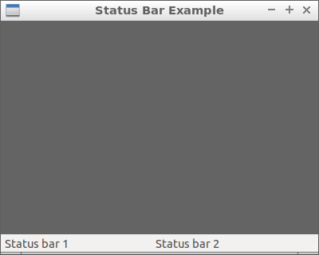

05 Status Bar
===



```c++
#include <wx/wx.h>

//declare a application

class MyApp : public wxApp {
public:
  virtual bool OnInit();
};

//declare a frame

class MyFrame : public wxFrame {
public:
  MyFrame();
private:
};

//define method of the application.

bool MyApp::OnInit() {
  MyFrame *frame = new MyFrame();
  frame->Show(true);
  return true;
}

//define constructor of frame.

MyFrame::MyFrame()
: wxFrame(NULL, wxID_ANY, "Status Bar Example", wxDefaultPosition, wxSize(400, 320)) {
  wxPanel * panel = new wxPanel(this, wxID_ANY);
  panel->SetBackgroundColour(wxColour(100, 100, 100));

  wxStatusBar *sb = this->CreateStatusBar(2);
  sb->SetStatusText("Status bar 1", 0);
  sb->SetStatusText("Status bar 2", 1);
}

wxIMPLEMENT_APP(MyApp); //implement the application
```


毫無反應，就只是個狀態列...

插入一個 panel 改了顏色，比較好區分狀態列。


### 參考

https://docs.wxwidgets.org/3.0/classwx_status_bar.html

https://docs.wxwidgets.org/stable/classwx_frame.html