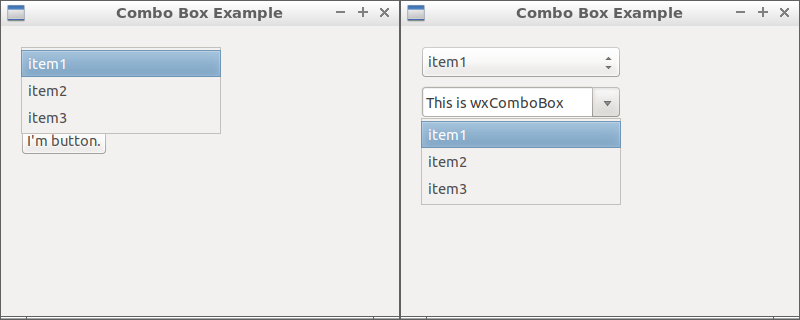
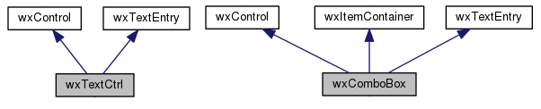

07 Combo Box ( wxChoice & wxComboBox )
===



```c++
#include <wx/wx.h>
//declare a application

class MyApp : public wxApp {
public:
  virtual bool OnInit();
};

//declare a frame

class MyFrame : public wxFrame {
public:
  MyFrame();
private:
  wxButton *button;
  wxChoice * choice;
  wxComboBox * comboBox;

  void buttonClicked(wxCommandEvent & event);
};

//define method of the application.

bool MyApp::OnInit() {
  MyFrame *frame = new MyFrame();
  frame->Show(true);
  return true;
}

//define constructor of frame.

MyFrame::MyFrame()
: wxFrame(NULL, wxID_ANY, "Combo Box Example", wxDefaultPosition, wxSize(400, 320)) {
  wxPanel * panel = new wxPanel(this, wxID_ANY);

  wxArrayString *selection = new wxArrayString;
  selection->Add("item1");
  selection->Add("item2");
  selection->Add("item3");

  this->choice = new wxChoice(panel, wxID_ANY, wxPoint(20, 20),
          wxSize(200, 32), *selection);

  this->comboBox = new wxComboBox(panel, wxID_ANY, "This is wxComboBox",
          wxPoint(20, 60), wxSize(200, 32), *selection);

  this->button = new wxButton(panel, wxID_ANY, wxT("I'm button."),
          wxPoint(20, 100), wxDefaultSize, 0);

  Connect(this->button->GetId(), wxEVT_COMMAND_BUTTON_CLICKED,
          wxCommandEventHandler(MyFrame::buttonClicked));
}

void MyFrame::buttonClicked(wxCommandEvent & event) {
  wxString str("wxChoice GetStringSelection: " + this->choice->GetStringSelection());
  wxLogMessage(str);
  str = "wxComboBox GetValue: " + this->comboBox->GetValue();
  wxLogMessage(str);
}

wxIMPLEMENT_APP(MyApp); //implement the application
```


### wxComboBox



它其實就像是 InputBox ( wxTextCtrl  ) ，只是多了選項。


### 參考

https://forums.wxwidgets.org/viewtopic.php?t=1203

https://docs.wxwidgets.org/3.0/classwx_combo_box.html

https://docs.wxwidgets.org/3.0/classwx_text_ctrl.html