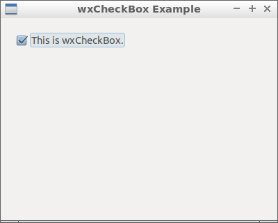

09 Check Box ( wxCheckBox )
===



```c++
#include <wx/wx.h>

//declare a application

class MyApp : public wxApp {
public:
  virtual bool OnInit();
};

//declare a frame

class MyFrame : public wxFrame {
public:
  MyFrame();
private:
  wxButton *button;
  wxCheckBox * checkBox;

  void checkBoxClicked(wxCommandEvent & event);
};

//define method of the application.

bool MyApp::OnInit() {
  MyFrame *frame = new MyFrame();
  frame->Show(true);
  return true;
}

//define constructor of frame.

MyFrame::MyFrame()
: wxFrame(NULL, wxID_ANY, "wxCheckBox Example", wxDefaultPosition, wxSize(400, 320)) {
  wxPanel * panel = new wxPanel(this, wxID_ANY);

  this->checkBox = new wxCheckBox(panel, wxEVT_CHECKBOX, wxT("This is wxCheckBox."), wxPoint(20, 20));

  Connect(wxEVT_CHECKBOX, wxEVT_COMMAND_CHECKBOX_CLICKED,
          wxCommandEventHandler(MyFrame::checkBoxClicked));
}

void MyFrame::checkBoxClicked(wxCommandEvent & event) {
  wxString str("wxCheckBOx IsChecked: "  );
  str += (this->checkBox->IsChecked()) ? "true" : "false";
  wxLogMessage(str);
}

wxIMPLEMENT_APP(MyApp); 
```


### 參考

http://zetcode.com/gui/wxwidgets/widgets/

https://docs.wxwidgets.org/3.0/classwx_check_box.html