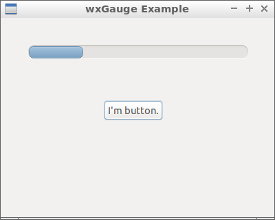

11 Progress Bar ( wxGauge )
===



```c++
#include <wx/wx.h>
//declare a application

class MyApp : public wxApp {
public:
  virtual bool OnInit();
};

//declare a frame

class MyFrame : public wxFrame {
public:
  MyFrame();
private:
  wxButton *button;
  wxGauge *gauge;

  void buttonClicked(wxCommandEvent & event);
};

//define method of the application.

bool MyApp::OnInit() {
  MyFrame *frame = new MyFrame();
  frame->Show(true);
  return true;
}

//define constructor of frame.

MyFrame::MyFrame()
: wxFrame(NULL, wxID_ANY, "wxGauge Example", wxDefaultPosition, wxSize(400, 320)) {
  wxPanel * panel = new wxPanel(this, wxID_ANY);

  this->gauge = new wxGauge(panel, wxID_ANY, 16, wxPoint(40, 40), wxSize(320, 20));


  this->button = new wxButton(panel, wxID_ANY, wxT("I'm button."),
          wxPoint(150, 120), wxDefaultSize, 0);

  Connect(this->button->GetId(), wxEVT_COMMAND_BUTTON_CLICKED,
          wxCommandEventHandler(MyFrame::buttonClicked));
}

void MyFrame::buttonClicked(wxCommandEvent & event) {
  int value = this->gauge->GetValue() + 1;
  if (value > this->gauge->GetRange()) {
    return;
  }
  this->gauge->SetValue(value);
}

wxIMPLEMENT_APP(MyApp); //implement the application
```


進度條的賦值如果大於範圍( Range )程序會崩潰，要自己注意例外喔。

### 參考

https://docs.wxwidgets.org/3.0/classwx_gauge.html

