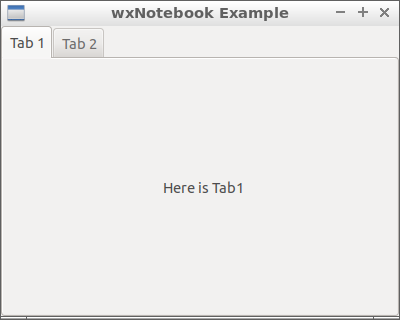

12 Tab Panel ( wxNotebook )
===



```c++
#include <wx/wx.h>
#include <wx/notebook.h>
//declare a application

class MyApp : public wxApp {
public:
  virtual bool OnInit();
};

//declare a frame

class MyFrame : public wxFrame {
public:
  MyFrame();
private:
  wxNotebook* notebook;
  wxPanel * panel1;
  wxPanel * panel2;
};

//define method of the application.

bool MyApp::OnInit() {
  MyFrame *frame = new MyFrame();
  frame->Show(true);
  return true;
}

//define constructor of frame.

MyFrame::MyFrame()
: wxFrame(NULL, wxID_ANY, "wxNotebook Example", wxDefaultPosition, wxSize(400, 320)) {
  this->notebook = new wxNotebook(this, wxID_ANY);
  this->panel1 = new wxPanel(this->notebook, wxID_ANY);
  this->panel2 = new wxPanel(this->notebook, wxID_ANY);

  this-> notebook->AddPage(this->panel1, "Tab 1");
  this-> notebook->AddPage(this->panel2, "Tab 2");

  new wxStaticText(this->panel1, wxID_ANY, "Here is Tab1", wxPoint(160, 120), wxSize(100, 20));
  new wxStaticText(this->panel2, wxID_ANY, "Here is Tab2", wxPoint(160, 120), wxSize(100, 20));
}

wxIMPLEMENT_APP(MyApp); //implement the application
```


### 參考

https://docs.wxwidgets.org/3.0/classwx_notebook.html