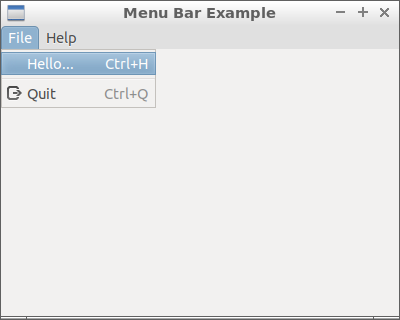

13 Menu Bar ( wxMenu & wxMenuBar )
===



 ```c++
#include <wx/wx.h>
//declare a application

class MyApp : public wxApp {
public:
  virtual bool OnInit();
};

//declare a frame

class MyFrame : public wxFrame {
public:
  MyFrame();
private:
  void OnExit(wxCommandEvent& event);
  void OnAbout(wxCommandEvent& event);
  void OnHello(wxCommandEvent& event);
};

//define method of the application.

bool MyApp::OnInit() {
  MyFrame *frame = new MyFrame();
  frame->Show(true);
  return true;
}

//define constructor of frame.

MyFrame::MyFrame()
: wxFrame(NULL, wxID_ANY, "Menu Bar Example", wxDefaultPosition, wxSize(400, 320)) {
  wxMenu *menuFile = new wxMenu;
  menuFile->Append(1, "&Hello...\tCtrl-H",
          "Help string shown in status bar for this menu item");
  menuFile->AppendSeparator();
  menuFile->Append(wxID_EXIT);

  wxMenu *menuHelp = new wxMenu;
  menuHelp->Append(wxID_ABOUT);

  wxMenuBar *menuBar = new wxMenuBar;
  menuBar->Append(menuFile, "File");
  menuBar->Append(menuHelp, "Help");
  this->SetMenuBar(menuBar);

  this->Bind(wxEVT_MENU, &MyFrame::OnHello, this, 1);
  this->Bind(wxEVT_MENU, &MyFrame::OnAbout, this, wxID_ABOUT);
  this->Bind(wxEVT_MENU, &MyFrame::OnExit, this, wxID_EXIT);
}

void MyFrame::OnExit(wxCommandEvent& event) {
  this->Close(true);
}

void MyFrame::OnAbout(wxCommandEvent& event) {
  wxMessageBox("This is a wxMenu & wxMenuBar example",
          "About Menu Example", wxOK | wxICON_INFORMATION);
}

void MyFrame::OnHello(wxCommandEvent& event) {
  wxLogMessage("Hello world from wxWidgets!");
}

wxIMPLEMENT_APP(MyApp); //implement the application
 ```


### 參考

https://docs.wxwidgets.org/trunk/overview_helloworld.html

https://docs.wxwidgets.org/stable/classwx_menu.html

https://docs.wxwidgets.org/stable/classwx_menu_bar.html

